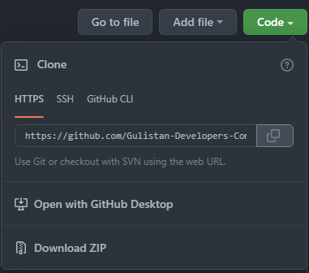
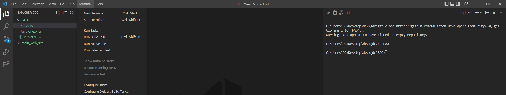

# FAQ

[Node](https://nodejs.org/en/) va [Git](https://git-scm.com/download/win) ni kompyuteringizga o'rnating!

1. [main_web_site repository](https://github.com/Gulistan-Developers-Community/main_web_site) clone qilinadi 

2. [Visualstudio_Code](https://code.visualstudio.com/) ga kirib **Terminal/New_Terminal** ochiladi 

3. Terminalda /main_web_site papkasiga o'ting (cd komandasi orqali. Masalan cd main_web_site)

4. So'ng **git branch** deb yozsangiz branchlar yani shoxlari listi chiqadi.

5. 3ta branch bor: main, html/css va react. Siz html/css yoki react(Masalan git switch react yoki git switch html/css) GA O'TIB! **git checkout -b** react_ismingiz yoki html/css_ismingiz ni yozasiz. Masalan **git checkout -b html/css_otabek** (kichik harflarda yozing!)

5.1. Agar branchlar listi bo'lmasa **git checkout -b <sizning ismingiz>** deb o'z branchingizni oching.

6. So'ngra, ANNIQ TEKSHIRING! **git branch** deb yozsangiz <html/css_ismingiz> chiqishi kerak!

7. Mana endi bemalol kod yozishingiz mumkin!

Figma dizaynni o'zim bir amallab qildim [figma](<https://www.figma.com/file/yKNrPueL5NxwcrbdJ5lI6n/Neubrutalism-Landing-Page-Design-(Community)?node-id=104%3A272>) hali yana narsalar qo'shiladi!
Siz albatta yangiliklar kiritib chiroylilashtirishingiz mumkin
So'zlar o'zbekcha matnga almashtirilishi kerak. Hozircha fikrlar yo'qligi uchun hechnima yozmadim.
